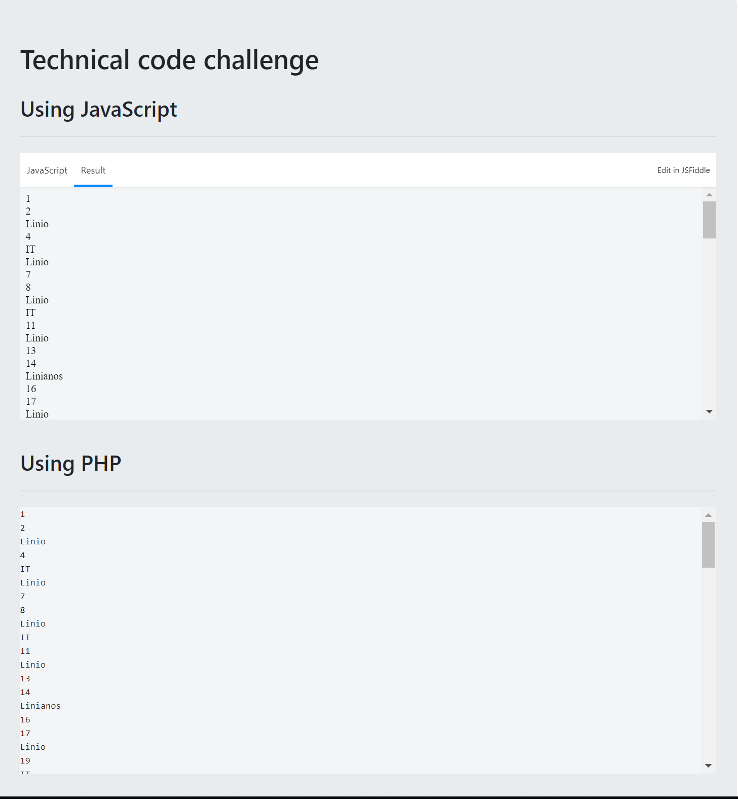

# Linio
> Technical code challenge

## Challenge – Backend Developer

Write a program that prints all the numbers from 1 to 100. However, for
multiples of 3, instead of the number, print "Linio". For multiples of 5 print
"IT". For numbers which are multiples of both 3 and 5, print "Linianos".

But here's the catch: you can use only one `if`. No multiple branches, ternary
operators or `else`.

## Requirements
* 1 if
* You can't use `else`, `else if` or ternary
* Unit tests
* Feel free to apply your SOLID knowledge
* You can write the challenge in any language you want. Here at Linio we are
big fans of PHP, Kotlin and TypeScript

## Submission
You can create a public repository on your GitHub account and send the
link to us, or just send us a zip file.

## Install

    $ git clone https://github.com/leo4all/linio.git
    $ cd linio
    $ composer install
    $ composer dump-autoload -o

---

## Meta

Leonel Urbina – leonel.urbina.hn[at]gmail.com

Distributed under the MIT license. See ``LICENSE`` for more information.

[https://github.com/leo4all/linio](https://github.com/leo4all/)

## Contributing

1. Fork it (<https://github.com/leo4all/linio/fork>)
2. Create your feature branch (`git checkout -b feature/fooBar`)
3. Commit your changes (`git commit -am 'Add some fooBar'`)
4. Push to the branch (`git push origin feature/fooBar`)
5. Create a new Pull Request

